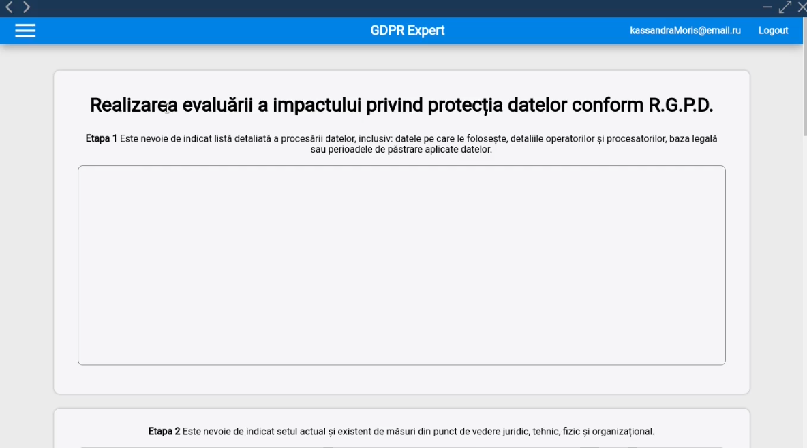

# GDPR Expert

## Application screens:





## Desktop:

### Requirements

1. node
2. npm
   
#### Edit file: gdpr-expert-desktop/src/app/constants/webServerUrl.ts

### Build desktop application

```bash
$ cd gdpr-expert-desktop/
$ npm install
$ nm run test
$ npm run package:linux
$ npm run package:win32
$ cd ..
```

## Web:

### Requirements

1. JDK-8
2. Tomcat Server
3. Postgres
   
### Build web application

```bash
$ cd gdpr-expert-web/
$ ./gradlew war
```

### Database migration

#### Edit file: flyway.properties


```bash
$ cd gdpr-expert-web/
$ ./gradlew flywayMigrate -PmigrationType=default # for application database
$ ./gradlew flywayMigrate -PmigrationType=test # for tests database
```

### Run web application
```bash
$ cp ./build/libs/gdpr-expert-web.war <path-to-tomcat>/webapps
$ bash <path-to-tomcat>/bin/startup.sh
```


